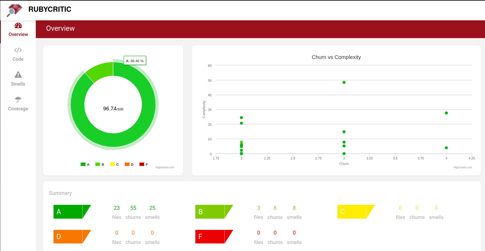
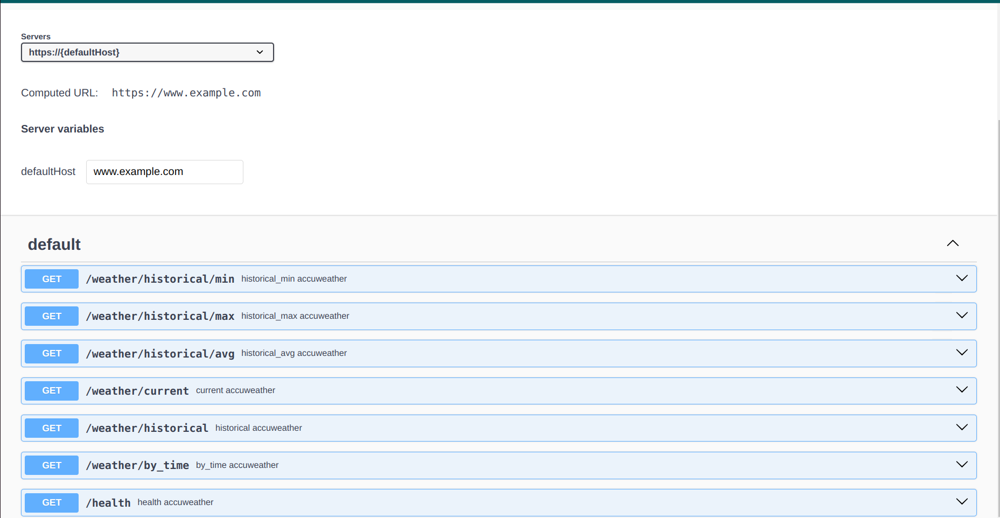

## 1. Подготовка проекта
Добавить в содержимое .env файла

- ACCUWEATHER_TOKEN=bRMTOFQMfAEXxvzMrItkGFdUiKeeZG0A
- LOCATION_KEY=28801

Или скопировать из .env.sample

## 2. Запуск приложения

- bundle install
- rails db:create && db:migrate
- rails s

## 3. Используемые технологии

- ✅ ruby 3.1.2, rails 7
- ✅ rufus for scheduled task
- ✅ swagger
- ✅ rspec, vcr
- ✅ redis for caching
- ✅ delayed job (active record)

## 4. Рабочие эндпоинты
- http://0.0.0.0:3000/health
- http://0.0.0.0:3000/weather/historical/max
- http://0.0.0.0:3000/weather/historical/min
- http://0.0.0.0:3000/weather/historical/avg
- http://0.0.0.0:3000/weather/current
- http://0.0.0.0:3000/weather/historical
- http://0.0.0.0:3000/weather/by_time?timestamp=value


## 5. Результат проверки rspec
```
Finished in 0.22716 seconds (files took 1.22 seconds to load)
16 examples, 0 failures
```


## 6. Результат сканирования уязвимостей BRAKEMAN (Дополнительно)

```
== Brakeman Report ==

Application Path: /home/dima/rails/t1_test
Rails Version: 7.2.1
Brakeman Version: 6.2.1
Scan Date: 2024-10-13 12:43:33 +0300
Duration: 0.330077508 seconds
Checks Run: BasicAuth, BasicAuthTimingAttack, CSRFTokenForgeryCVE, ContentTag, CookieSerialization, CreateWith, CrossSiteScripting, DefaultRoutes, Deserialize, DetailedExceptions, DigestDoS, DynamicFinders, EOLRails, EOLRuby, EscapeFunction, Evaluation, Execute, FileAccess, FileDisclosure, FilterSkipping, ForgerySetting, HeaderDoS, I18nXSS, JRubyXML, JSONEncoding, JSONEntityEscape, JSONParsing, LinkTo, LinkToHref, MailTo, MassAssignment, MimeTypeDoS, ModelAttrAccessible, ModelAttributes, ModelSerialize, NestedAttributes, NestedAttributesBypass, NumberToCurrency, PageCachingCVE, Pathname, PermitAttributes, QuoteTableName, Ransack, Redirect, RegexDoS, Render, RenderDoS, RenderInline, ResponseSplitting, RouteDoS, SQL, SQLCVEs, SSLVerify, SafeBufferManipulation, SanitizeConfigCve, SanitizeMethods, SelectTag, SelectVulnerability, Send, SendFile, SessionManipulation, SessionSettings, SimpleFormat, SingleQuotes, SkipBeforeFilter, SprocketsPathTraversal, StripTags, SymbolDoSCVE, TemplateInjection, TranslateBug, UnsafeReflection, UnsafeReflectionMethods, ValidationRegex, VerbConfusion, WeakRSAKey, WithoutProtection, XMLDoS, YAMLParsing

== Overview ==

Controllers: 2
Models: 2
Templates: 2
Errors: 0
Security Warnings: 0

== Warning Types ==


No warnings found
```

## 7. Добавление аннотаций к моделям
```
# == Schema Information
#
# Table name: forecasts
#
#  id          :bigint           not null, primary key
#  temperature :decimal(, )      not null
#  epoch_time  :datetime         not null
#  created_at  :datetime         not null
#  updated_at  :datetime         not null
#
class Forecast < ApplicationRecord
end
```

## 8. Результат проверки Rubocop
```
dima@notebook:~/rails/t1_test$ rubocop
Inspecting 62 files
..............................................................

62 files inspected, no offenses detected
```

## 9. Результат проверки Rubycritic


## 10. Результат запуска Swagger документации

